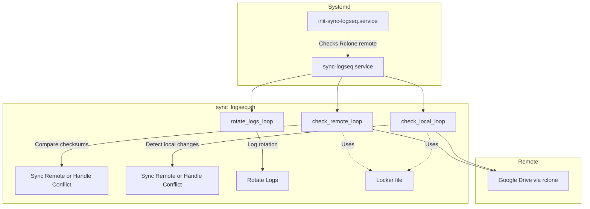

# Multi-Device Synchronization

## 📝 Description

This project provides an automated synchronization system between local and remote directories (e.g. Google Drive) using `rclone` and `inotifywait`.
It ensures:

* Automatic synchronization after local or remote changes
* Handling of no-internet situations (retry mechanism)
* Detection and resolution of synchronization conflicts
* Robust process management through `systemd` user services

The synchronization runs continuously via two `systemd` services:

* `init-sync-logseq.service` — checks remote accessibility
* `sync-logseq.service` — performs continuous file synchronization

---

## Table of Contents
- [Multi-Device Synchronization](#multi-device-synchronization)
  - [📝 Description](#-description)
  - [Table of Contents](#table-of-contents)
  - [⚙️ Set up the tool](#️-set-up-the-tool)
    - [**Prerequisites**](#prerequisites)
    - [**Configuration**](#configuration)
    - [**Set up Google Drive remote (example)**](#set-up-google-drive-remote-example)
    - [**Installation**](#installation)
  - [🧪 Run the tests](#-run-the-tests)
  - [⚙️ How it works](#️-how-it-works)
    - [**Overview**](#overview)
    - [**Service configuration**](#service-configuration)
  - [🔁 Inside the synchronization logic](#-inside-the-synchronization-logic)
    - [**Loop descriptions**](#loop-descriptions)
      - [🛰️ `check_remote_loop`](#️-check_remote_loop)
      - [💻 `check_local_loop`](#-check_local_loop)
      - [🧱 `locker` mechanism](#-locker-mechanism)
      - [🧾 `rotate_logs_loop`](#-rotate_logs_loop)
  - [🧭 Architecture overview](#-architecture-overview)
  - [🧩 Useful commands](#-useful-commands)
    - [**List processes related to inotify**](#list-processes-related-to-inotify)
    - [**Inspect process tree**](#inspect-process-tree)
    - [**Kill all related processes safely**](#kill-all-related-processes-safely)
  - [📚 Summary of systemd parameters](#-summary-of-systemd-parameters)
  - [🔗 Source Repository](#-source-repository)

---

## ⚙️ Set up the tool

### **Prerequisites**

* Linux environment with `systemd` (user-level services)
* **Python** installed
* `rclone` and `inotify-tools` installed

### **Configuration**

Edit the `config.env` file to set your variables:

```bash
...

##### ---- sync-logseq Script Variables ---- #####
REMOTE_NAME="MyRemote"  # Name of your rclone remote
LOCAL_DIR_ROOT="/path/to/local/directory"
REMOTE_DIR_ROOT="$REMOTE_NAME:/path/to/remote/directory"
CONFIG_PATH="/home/username/.config/rclone/rclone.conf"

...
```

---

### **Set up Google Drive remote (example)**

To configure a Google Drive remote with `rclone`:

```bash
rclone config
# -> n (new remote)
# -> name: MyRemote
# -> storage: drive
# -> follow authentication steps
```

Then reconnect automatically if needed:

```bash
rclone config reconnect MyRemote: --config="$HOME/.config/rclone/rclone.conf" --auto-confirm
```

---

### **Installation**

Clone and set up the project:

```bash
git clone https://github.com/gwendalauphan/synchronisation-mutli-devices.git
cd synchronisation-mutli-devices
./set_up.sh
```

The setup script will:

* Build the service files from Jinja templates
* Create the required `~/.config/systemd/user` directory
* Load and enable the new services

---

## 🧪 Run the tests

Enter the test directory and run a scenario:

```bash
cd Tests
./test_scenario.sh simu|real
```

* **simu** → simulates a remote folder locally
* **real** → uses the actual remote folder configured in `config.env`

---

## ⚙️ How it works

### **Overview**

There are **two main systemd services** working together:

1. **`init-sync-logseq.service`**

   * Checks that the remote (`rclone` remote) is reachable.
   * If successful, it triggers the next service.

2. **`sync-logseq.service`**

   * Handles both local and remote synchronization loops.
   * Automatically restarts if an error occurs.

---

### **Service configuration**

`~/.config/systemd/user/sync-logseq.service`

```ini
[Unit]
Description=File synchronization for Logseq using inotify and rclone
Requires=init-sync-logseq.service
After=init-sync-logseq.service

[Service]
ExecStart=/home/gwendalauphan/Documents/Informatique/Projets/Synchronisation-multi-devices/sync_logseq.sh
Restart=on-failure
RestartSec=5s
StartLimitInterval=30s
StartLimitBurst=5

[Install]
WantedBy=default.target
```

To reload and activate the services:

```bash
systemctl --user daemon-reload
systemctl --user enable sync-logseq.service
systemctl --user start sync-logseq.service
systemctl --user status sync-logseq.service
```

---

## 🔁 Inside the synchronization logic

The core logic is in `sync_logseq.sh`.
It runs **three main loops**, each in its own background process:

```bash
check_remote_loop &
check_remote_loop_pid=$!

check_local_loop &
check_local_loop_pid=$!

rotate_logs_loop &
rotate_logs_loop_pid=$!
```

This allows clean process management — all child PIDs are tracked and terminated properly when the service stops or fails.

---

### **Loop descriptions**

#### 🛰️ `check_remote_loop`

* Runs continuously at a defined interval (`REMOTE_CHECK_INTERVAL`)
* Compares checksums between previous and current remote snapshots
* On differences → triggers `sync_remote` or `handle_conflicts` depending on the situation

#### 💻 `check_local_loop`

* Uses `inotifywait` to detect local file changes
* On modification → calculates both local and remote checksums
* If conflict → calls `handle_conflicts`
* Otherwise → triggers `sync_remote`

#### 🧱 `locker` mechanism

To prevent infinite loops between `rclone` operations and `inotifywait` detections, a **lock file** is used to coordinate between loops safely.

#### 🧾 `rotate_logs_loop`

* Handles log rotation specifically for this service (similar to `logrotate`)
* Keeps log size under control

---

## 🧭 Architecture overview



---

## 🧩 Useful commands

### **List processes related to inotify**

```bash
lsof | grep inotify
```

### **Inspect process tree**

```bash
ps -eo pid,pgid,ppid,comm | grep "inotify"
```

### **Kill all related processes safely**

```bash
lsof | grep inotifywa | grep "/home/gwendalauphan/Documents/Synchronisation-multi-devices" \
| awk '{print $2}' | while read pid; do
    pgid=$(ps -o pgid= -p "$pid" 2>/dev/null | tr -d ' ')
    if [[ -n "$pgid" ]]; then
        ps -eo pid,pgid,comm | awk -v pgid="$pgid" '$2 == pgid {print $1}' | xargs -r kill -9
    fi
done
```

---

## 📚 Summary of systemd parameters

| Section       | Parameter     | Description                                       |
| ------------- | ------------- | ------------------------------------------------- |
| **[Unit]**    | `Description` | Description of the service.                       |
|               | `Requires`    | Ensures dependency on another service.            |
|               | `After`       | Starts after a specific service or target.        |
| **[Service]** | `ExecStart`   | Command or script to execute.                     |
|               | `Restart`     | Restart policy (`on-failure`, `always`, etc.).    |
|               | `RestartSec`  | Delay before restarting after failure.            |
| **[Install]** | `WantedBy`    | Specifies which target should start this service. |

---

## 🔗 Source Repository

[https://github.com/gwendalauphan/synchronisation-mutli-devices.git](https://github.com/gwendalauphan/synchronisation-mutli-devices.git)
